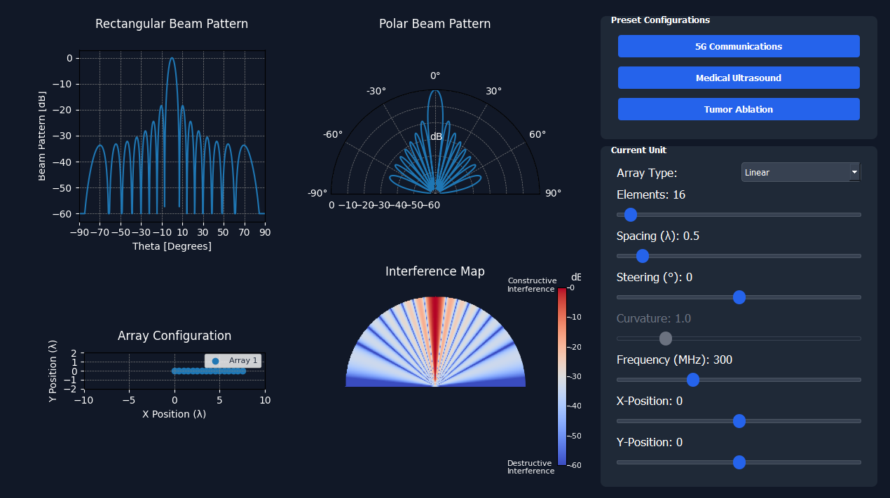

# Beamforming-Simulator
An interactive tool for customizing and visualizing beamforming parameters, phased array geometries, and interference patterns, with scenarios inspired by 5G, ultrasound, and tumor ablation.

<div align = "center">
    
</div>

## Table of Contents
- [Prerequisites](#prerequisites)
- [Installation](#installation)
- [Features](#features)
- [Contributors](#contributors)


## Prerequisites

- Python 3.6 or higher

## Installation

1. **Clone the repository:**

   ``````
   git clone https://github.com/AhmedAmgadElsharkawy/Beamforming-Simulator.git
   ``````

2. **Install The Dependincies:**
    ``````
    pip install -r requirements.txt
    ``````

3. **Run The App:**

    ``````
    python main.py
    ``````

## Features

- **Real-time Beam Steering**: Customize system parameters such as the number of transmitters/receivers, applied delays/phase shifts, and operating frequencies. Control the beam direction in real-time for dynamic simulations.

- **Phased Array Geometry Customization**: Adjust the geometry of the phased array, including options for linear or curved arrays. Curvature parameters are also customizable for advanced beamforming configurations.

- **Constructive/Destructive Interference Visualization**: View the interference pattern map, showcasing regions of constructive and destructive interference, along with the beam profile in synchronized visualizers.

- **Multiple Phased Array Units**: Add and customize multiple phased array units to the system. Modify their locations and individual parameters to simulate complex beamforming scenarios.

- **Pre-configured Scenarios**: Load and explore at least three different scenarios inspired by real-world applications such as 5G, Ultrasound, and tumor ablation. Users can visualize and fine-tune the parameters of each scenario.

## Contributors
- **AhmedAmgadElsharkawy**: [GitHub Profile](https://github.com/AhmedAmgadElsharkawy)
- **AbdullahMahmoudHanafy**: [GitHub Profile](https://github.com/AbdullahMahmoudHanafy)
- **Mohamed-185**: [GitHub Profile](https://github.com/Mohamed-185)
- **RawanAhmed444**: [GitHub Profile](https://github.com/RawanAhmed444)

